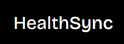

<!-- Improved compatibility of back to top link: See: https://github.com/othneildrew/Best-README-Template/pull/73 -->
<a name="readme-top"></a>

<!-- PROJECT LOGO -->
<br />
<div align="center">
  <a href="https://github.com/NotTheRightGuy/HealthSync-DotSlash-7.0">
    
  </a>

  <h3 align="center">Health Care management website</h3>
</div>

<!-- ABOUT THE PROJECT -->
## About HealthSync
HealthSync is a comprehensive platform designed to streamline the entire healthcare process, from patient prescription submission to disease prediction, doctor feedback, and prescription generation. This user-friendly system seamlessly connects patients, doctors, and their medical histories, ensuring a holistic and efficient healthcare experience.
  

### Built With

This section should list any major frameworks/libraries used to bootstrap your project. Leave any add-ons/plugins for the acknowledgements section. Here are a few examples.

* [![React][React.js]][React-url]
* [![Vite][Vite.js]][Vite-url]
* [![Express][Express.js]][Express-url]
* [![MongoDB][Mongodb.com]][MongoDB-url]

<p align="right">(<a href="#readme-top">back to top</a>)</p>

<!-- GETTING STARTED -->
## Getting Started

This is an example of how you may give instructions on setting up your project locally.
To get a local copy up and running follow these simple example steps.

### Prerequisites

This is an example of how to list things you need to use the software and how to install them.
* npm
  ```sh
  npm install npm@latest -g
  ```

### Installation

_Below is an example of how you can instruct your audience on installing and setting up your app. This template doesn't rely on any external dependencies or services._

1. Clone the repo
   ```sh
   git clone https://github.com/NotTheRightGuy/HealthSync-DotSlash-7.0
   ```
2. Install NPM packages
   ```sh
   npm install
   ```

<p align="right">(<a href="#readme-top">back to top</a>)</p>

<!-- USAGE EXAMPLES -->
## Usage

You will need the following database to setup the backend server locally on your machine
### ![Mistral] (https://huggingface.co/TheBloke/dolphin-2_6-phi-2-GGUF)

<p align="right">(<a href="#readme-top">back to top</a>)</p>

<!-- CONTRIBUTING -->
## Contributing

Contributions are what make the open source community such an amazing place to learn, inspire, and create. Any contributions you make are **greatly appreciated**.

If you have a suggestion that would make this better, please fork the repo and create a pull request. You can also simply open an issue with the tag "enhancement".
Don't forget to give the project a star! Thanks again!

1. Fork the Project
2. Create your Feature Branch (`git checkout -b feature/AmazingFeature`)
3. Commit your Changes (`git commit -m 'Add some AmazingFeature'`)
4. Push to the Branch (`git push origin feature/AmazingFeature`)
5. Open a Pull Request

<p align="right">(<a href="#readme-top">back to top</a>)</p>


## User Flow
### Login
  

### Doctor's Dashboard
1) Patient Appointments
  

2) Patient Details
    

### User's Dashboard 
1) Your Doctor Details
    

## Features

- **Prescription Prediction:**
  - Predict diseases based on patient symptoms and medical history.
  - Generate preliminary prescriptions tailored to predicted diseases.

- **Prescription Management:**
  - Store and manage all prescriptions, both generated by the system and uploaded by patients.
  - Access historical prescription data for better healthcare insights.

- **Doctor Feedback System:**
  - Send predicted disease reports and prescriptions to doctors for verification.
  - Enable doctors to review, modify, or confirm predictions and prescriptions.
  - Send finalized prescriptions and disease reports back to patients.

- **Patient Dashboard:**
  - User-friendly interface for patients to input symptoms, view predictions, and manage health records.
  - Display personalized health insights and recommendations based on historical data.

- **Doctor Portal:**
  - Allow doctors to access patient data, review predictions, and provide feedback.
  - Support real-time communication through secure messaging.

- **Appointment Management:**
  - Schedule appointments, virtual or in-person, based on doctor recommendations.
  - Minimize unnecessary visits with optimized virtual consultations.

- **Security and Privacy:**
  - Implement robust security measures to protect patient data.
  - Adhere to healthcare data privacy standards and regulations.
   
  


<!-- LICENSE -->
## License

Distributed under the MIT License. See `LICENSE.txt` for more information.

<p align="right">(<a href="#readme-top">back to top</a>)</p>


